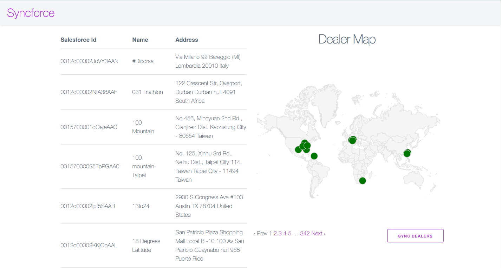

# Sync salesforce dealer data

[](https://heroku.com/deploy)

This application syncs data from salesforce to the database and display the data in a map



### Tech
  - Backend
    - Ruby 2.7.1
    - Rails 6.0.3
    - [Delayed Job](https://rubydoc.info/gems/delayed_job/2.1.4/frames)
  - Frontend
    - Webpack
    - React
    - [react-google-charts](https://www.npmjs.com/package/react-google-charts)
    - [Milligram](https://milligram.io/)
  - Database
    - sqlite3
  - Testing
    - Capybara
    - Rspec

### Design patterns
  1. Interactors - Interactors are an overkill for a small application like this. But interactors are fun ¯\_(ツ)_/¯  see `app/interactors`
  2. Service objects - see `app/services`

### Run tests
  ```sh
  $ bundle exec rspec
  ```

### Installation and development setup
Make sure you have Ruby 2.7.1 before installation

```sh
$ cd syncforce
```
Add app configuration in `config/application.yml`
```YML
development:
  sf_host: test.salesforce.com
  sf_username: webshop@on-running.com.uat
  sf_password: HGlnGCyLYqEFjmAxv2ype9nDbUBJDsWYypgIe6egembIGh3LsaGKUC4
  sf_client_id: 3MVG9lcxCTdG2VbtWAnBLcHTY._ahlEl2i0fxZ1XbZAKdzqKMuvDz62FAt8dol4pcWeb.T203Z0kLXKWNCr4p
  sf_client_secret: D656D8E6C36903F7395286953AEC11FDEABCC80D62048632341699F8A661A92A
  maps_api_key: YOUR_MAPS_API_KEY
```
Install dependencies..
```sh
$ bundle install
$ rails db:create db:migrate
```
Start background job worker...
```sh
$ rails jobs:work
```
start server..

```sh
$ rails server
```
### Todos

 - [] Add map interactions using react hooks

License
----

MIT
